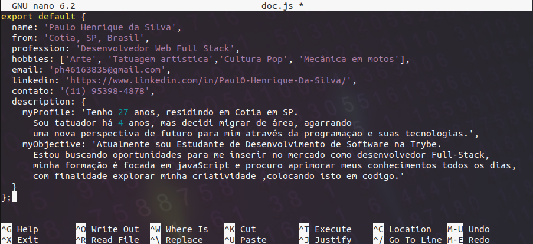

## < 👋 Olá, Bem-vindo ao meu perfil no Github! />

  <a href="https://github.com/Paul0-Henrique-Da-Silva">
  
  

 

| Property                                        | Data          
|------------------------------------------------|---------------------------------------------------------------------------------------------------------|
|:abacus: Language                                     ||
|  :page_with_curl: Front-end                 |      |  
|📦  Back-end                                |        |
| :mechanical_arm: Superset                   | 
|  :hammer: Tests                            |   |
|  :wrench: Tools                             |        |  
| :computer: OS                               |   |    
  
   
###### :speech_balloon: Contact
  

  
 
